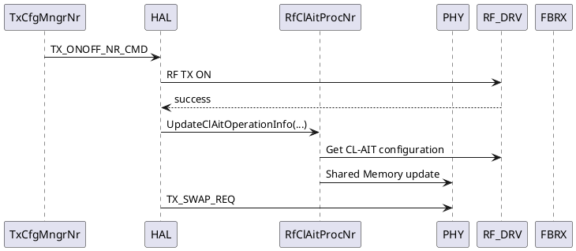
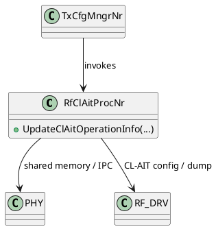

# CL-AIT NR As-Built HLD 정리/업데이트 착수 프롬프트

## 목적

현재 CL-AIT NR 코드 수정과 UT 코드 작성까지 완료된 상태다.

기존에 작성된 **Integrated NR HLD를 새로 작성하지 말고**, 현재 실제 구현 코드를 기준으로 검증·보강하여 **NR As-Built HLD**로 업데이트하라.

사용자는 개별 스킬 호출 순서를 직접 지정하지 않는다.  
`cl-ait-dev-orchestrator`를 단일 진입점으로 사용하고, 내부에서 필요한 경우 아래 스킬을 상황에 맞게 호출하라.

- `code-analyzer`
- `hld-code-implement`
- `hld-composer`
- `doc-converter`
- 필요 시 `hld-code-compare`

---

# 0. 최우선 원칙

1. **채팅은 임시 작업 공간이다.**
2. 기존 HLD / Decision Ledger / 최신 `gap_report.yaml` / 실제 구현 코드가 근거다.
3. **실제 코드에 없는 내용을 추정해서 HLD에 쓰지 마라.**
4. 기존 HLD를 폐기하고 처음부터 다시 작성하지 마라.
5. 기존 HLD의 설계 의도와 실제 구현이 다르면 차이를 숨기지 말고 `As-Built Deviation`으로 기록하라.
6. 이미 확정된 CL-AIT architecture decision을 임의 변경하지 마라.
7. 이번 단계는 **NR As-Built HLD 정리**가 목적이다.
8. LTE 구현은 수행하지 마라.
9. `code-fix`는 사용하지 마라.
10. 저사양 LLM에서 동작 가능하도록 전체 repository를 한 번에 분석하지 말고, 필요한 symbol/file/function 기준의 bounded analysis를 사용하라.

---

# 1. 현재 상태

현재 작업 상태는 다음과 같다.

```text
NR Integrated HLD               : 존재
NR gap_report.yaml              : 존재
NR 코드 수정                    : 완료
NR UT 코드 작성                 : 완료
Build Option 추가               : 반영됨 또는 최종 확인 필요
CMakeLists.txt 연동             : 반영됨 또는 최종 확인 필요
Generated file/source 연동      : 반영됨 또는 최종 확인 필요
Build/UT 실행 결과              : 실제 evidence 확인 필요
NR As-Built HLD                 : 아직 최종 정리 전
```

현재 구현은 기존 partial implementation을 이어서 완료한 결과다.  
기존 구현 내용을 새 baseline으로 재해석하거나 이전 diff를 잃어버리지 마라.

---

# 2. 현재 Architecture / Naming 기준

아래는 기존 Decision/HLD 기준으로 유지해야 한다.

## Target owner

```text
HAL
└─ RfClAitProcNr
```

- `RfClAitProcNr`는 CL-AIT NR runtime processor다.
- HAL ownership은 유지한다.
- `Rf`라는 이름을 RF Driver ownership으로 해석하지 마라.
- 기존 L1C `ClAitMngr`를 target architecture에 다시 넣지 마라.
- 별도 `ClAitConfigBuilder`를 새로 추가하지 마라.

## 주요 API

기준 API:

```cpp
RfClAitProcNr::UpdateClAitOperationInfo(...)
```

실제 구현 signature는 반드시 코드에서 확인해서 HLD에 반영하라.

---

# 3. NR TX ON As-Built 확인

기존 설계 기준:

```text
TX_ONOFF_NR_CMD
→ RF TX ON
→ RF TX ON 성공
→ RfClAitProcNr::UpdateClAitOperationInfo(...)
→ Shared Memory update
   - Enable
   - TxPwrThreshold
   - Period
→ TX_SWAP_REQ
```

다음 항목을 실제 코드로 확인하라.

- 실제 caller
- 실제 callee
- 실제 class/file
- 실제 argument
- `isScg` 전달 방식
- `domainType` 전달 방식
- RF TX ON 성공 판정 위치
- Shared Memory write 위치
- TX_SWAP_REQ와의 실제 ordering

설계와 코드가 다르면 `MATCH`, `IMPLEMENTATION_DETAIL_REFINED`, `DEVIATION`으로 구분하라.

---

# 4. NR Periodic Runtime As-Built 확인

기존 설계 기준:

```text
CL_AIT_DUMP_IND
→ TX Path ON guard
→ clait_enable 확인
→ CL_AIT_START_REQ
→ CL_AIT_START_CNF
   ├─ true  → PAL Timer
   └─ false → retry 1회
               ├─ true  → PAL Timer
               └─ false → current period skip
→ PAL Timer expiry
→ RF Driver AIT_Dump()
→ current period end
```

실제 코드에서 다음을 확인하라.

- DUMP_IND 실제 IPC 이름
- IPC handler
- payload
- `clait_enable` source
- TX Path ON 확인 source/API
- START_REQ 실제 IPC/API
- START_CNF 실제 IPC/API
- retry count / retry state
- retry가 정확히 1회인지
- retry 상태의 저장 위치
- PAL Timer API
- timer handle/context
- timer callback
- RF Driver dump API
- 실패/skip 시 period-local state 정리
- 다음 period로 retry/failure state가 carry-over 되지 않는지

확인할 수 없는 값은 추정하지 말고 `UNRESOLVED_CODE_FACT`로 남겨라.

---

# 5. Shared Memory / RF Driver As-Built 확인

다음 logical field를 실제 코드와 매핑하라.

```text
Enable
Tx Power Threshold
Period
```

확인 항목:

- 실제 struct 이름
- 실제 field 이름
- domain indexing
- write API
- RF Driver get API
- default/NV 값 획득 위치
- NR-specific field 변환
- `isScg` eligibility 적용 위치
- period 실제 단위
- period default 값

설계상의 이름과 실제 struct field 이름을 구분해서 문서화하라.

예:

```text
Logical name : TxPwrThreshold
Code field   : <actual field>
Owner        : <actual owner>
Source       : <actual RF API>
```

---

# 6. Build Integration As-Built 확인

이번 구현에서 중요한 추가사항이다.

다음 관계를 실제 코드 기준으로 반드시 HLD 또는 Implementation/Build section에 반영하라.

```text
Build Option
    ↓
CMakeLists.txt condition
    ↓
Generated file/source 선택
    ↓
Target source linkage
```

확인 항목:

- 실제 build option 이름
- option 정의 위치
- option 참조 위치
- `CMakeLists.txt` 파일 위치
- option condition
- 생성 파일명
- generated source/header 생성 위치
- target에 추가되는 방식
  - `target_sources`
  - `add_subdirectory`
  - 기타 실제 방식
- option ON일 때 생성/포함 여부
- option OFF일 때 기존 path 영향 여부

코드와 CMake 연결이 완전하지 않으면 HLD를 Freeze하지 말고 `BUILD_INTEGRATION_PENDING`으로 표시하라.

---

# 7. UT / Verification 정리

UT 코드 전체를 HLD에 복사하지 마라.

대신 HLD에는 다음 수준의 verification coverage를 기록하라.

예:

```text
Verification Coverage

- TX ON 이후 UpdateClAitOperationInfo 호출
- CL-AIT Enable/Disable 조건
- isScg eligibility
- Shared Memory Enable/Threshold/Period update
- TX Path OFF skip
- clait_enable=false skip
- START_REQ/CNF success
- START_CNF failure + retry once
- retry failure current period skip
- PAL Timer trigger
- RF Dump invocation
- Build Option ON
- Build Option OFF
- Generated source linkage
```

실제 존재하는 UT 기준으로만 작성하라.

UT가 없는 항목은 `NOT_COVERED`로 명시하라.

---

# 8. Build/UT Result Gate

코드와 UT 코드가 작성되어 있다고 해서 자동으로 HLD를 Freeze하지 마라.

실제 evidence를 확인하라.

## Case A — Build + UT PASS evidence 존재

```text
NR_AS_BUILT_HLD_STATUS = FREEZE_ALLOWED
```

→ 최종 As-Built HLD 생성 및 검증 진행

## Case B — Build 또는 UT 미실행 / 실패 / evidence 없음

```text
NR_AS_BUILT_HLD_STATUS = DRAFT_ONLY
```

→ HLD 업데이트는 수행 가능  
→ 최종 Freeze는 하지 말 것  
→ 미확인 validation 항목을 명확히 표시

---

# 9. HLD 업데이트 방법

기존 Integrated NR HLD를 source로 사용하라.

새 문서를 처음부터 재작성하지 말고 다음 순서로 진행하라.

```text
기존 Integrated NR HLD
+
실제 NR 구현 코드
+
UT 코드
+
최신 gap_report.yaml
+
hld-code-implement implementation evidence
+
hld_amend
        ↓
As-Built Gap 확인
        ↓
기존 HLD patch/update
        ↓
PlantUML 갱신
        ↓
Consistency validation
        ↓
NR As-Built HLD
```

---

# 10. gap_report / HLD Amendment 처리

최신 `gap_report.yaml`을 찾고 다음을 사용하라.

```text
meta.hld.*
gaps[].id
gaps[].hld_ref
gaps[].code_ref
gaps[].hld_amend
gaps[].fact_status
gaps[].implement_allowed
```

`hld_amend`는 `gap_report.yaml`을 SSOT로 사용하라.

이미 반영 완료된 amendment를 다시 적용하지 마라.

가능하면 GAP별로 다음 traceability를 유지하라.

| GAP ID | Design Requirement | Code Evidence | UT Evidence | HLD Section | Status |
|---|---|---|---|---|---|

Status 예:

```text
MATCH
IMPLEMENTATION_DETAIL_REFINED
HLD_UPDATED
DEVIATION
UNRESOLVED_CODE_FACT
NOT_COVERED
```

---

# 11. code-analyzer 사용 정책

전체 repository 광역 분석을 하지 마라.

필요한 경우 다음 범위만 targeted analysis하라.

- `RfClAitProcNr`
- `UpdateClAitOperationInfo`
- TX ON caller
- Shared Memory structure/API
- CL_AIT_DUMP_IND handler
- CL_AIT_START_REQ/CNF
- retry state
- PAL Timer
- RF Dump
- build option
- 관련 `CMakeLists.txt`
- generated source/file
- 관련 UT

이미 gap_report / implementation record에서 확정된 Fact는 중복 분석하지 마라.

---

# 12. PlantUML MSC / Class Diagram 작성 규칙

**MSC와 Class Diagram은 반드시 PlantUML로 작성하라.**

Markdown 표, ASCII art, Mermaid, 임의 이미지로 MSC/Class Diagram을 대체하지 마라.
HLD 본문에는 가능한 한 fenced `plantuml` source를 직접 포함하여 source와 문서가 함께 관리되도록 하라.

## 12.1 MSC (Sequence Diagram)

다음 주요 runtime flow는 각각 PlantUML MSC로 작성 또는 갱신하라.

1. NR TX ON / CL-AIT operation info update
2. Periodic CL-AIT 정상 수행
3. TX Path OFF skip
4. `clait_enable=false` skip
5. START_CNF failure → retry 1회 → success
6. START_CNF 2회 실패 → current period skip
7. PAL Timer expiry → RF Dump
8. 필요한 경우 Build/UT 동작 자체가 아니라 runtime 이해에 필요한 추가 flow

예시 형식:



위 코드는 형식 예시일 뿐이다.
**실제 participant / IPC / API / ordering은 반드시 현재 코드로 확인 후 반영하라.**

MSC 작성 시:

- 실제 class/module 명을 사용
- 실제 IPC/API 명을 사용
- 성공/실패/skip/retry branch를 `alt` / `else` / `opt` 등 PlantUML 문법으로 표현
- retry 1회 의미가 diagram에서 명확히 보이도록 표현
- 설계 문서에만 있고 코드에서 확인되지 않은 호출은 넣지 말 것
- 확인 불가 항목은 diagram에 추정 표기하지 말고 `UNRESOLVED_CODE_FACT`로 별도 관리

## 12.2 Class Diagram

CL-AIT NR As-Built 구조를 **PlantUML Class Diagram**으로 작성하라.

최소 확인 대상:

- `RfClAitProcNr`
- 실제 caller/owner class
- TX configuration 관련 실제 연결 class
- PHY IPC 연동 주체
- RF Driver 연동 주체
- Shared Memory 접근 관련 실제 주체
- PAL Timer callback/owner와 직접적인 class 관계가 있다면 포함

예시 형식:



위 예시의 관계도 실제 코드 확인 전에는 확정 관계로 사용하지 마라.

Class Diagram 작성 시:

- 실제 구현된 class 이름만 사용
- method/member는 실제 코드에서 확인된 것만 표시
- ownership, composition, aggregation, dependency를 임의 추정하지 말 것
- 단순 호출 관계면 dependency로 표현
- Singleton 여부도 실제 구현으로 확인된 경우만 표기
- `RfClAitProcNr`가 HAL owner라는 architecture 의미와 RF Driver ownership을 혼동하지 말 것
- legacy `ClAitMngr`를 target class diagram에 다시 넣지 말 것
- `ClAitConfigBuilder`를 새로 만들어 넣지 말 것
- 구현상 필요한 helper/context가 있으면 실제 코드 기준으로만 추가
- UT class는 핵심 production class diagram과 분리하거나 별도 verification diagram으로 관리

## 12.3 PlantUML Source 관리

가능하면 아래처럼 HLD 내 source를 직접 유지하라.

```text
HLD Markdown
 ├─ PlantUML MSC source
 ├─ PlantUML Class Diagram source
 └─ 설명 / traceability
```

필요하면 별도 `.puml` 파일도 생성할 수 있다.

권장 이름:

```text
CL_AIT_NR_TX_ON_MSC_<date>.puml
CL_AIT_NR_PERIODIC_MSC_<date>.puml
CL_AIT_NR_CLASS_DIAGRAM_<date>.puml
```

단, Markdown HLD와 별도 `.puml` source가 서로 다른 내용을 갖지 않도록 동일 source 기준으로 관리하라.

---

# 13. doc-converter 검증

HLD 업데이트 후 `doc-converter`를 이용해 가능한 범위에서 확인하라.

검증 목표:

```text
PlantUML syntax error          = 0
MSC participant mismatch       = 0
MSC message ordering mismatch  = 0
unmatched REQ/CNF              = 0
missing critical branch        = 0
Class Diagram symbol mismatch  = 0
Class/member/API mismatch      = 0
broken heading/reference       = 0
```

doc-converter 기능 제한으로 검증할 수 없는 항목은:

```text
DOC_CONVERTER_LIMITATION
```

으로 남기되, 검증한 것처럼 쓰지 마라.

---

# 14. 최종 HLD에 반드시 포함할 섹션

기존 HLD 구조를 최대한 유지하되 아래 내용은 존재해야 한다.

```text
1. Purpose / Scope
2. Architecture Overview
3. Class / Ownership
4. Configuration & Shared Memory
5. TX ON Runtime
6. Periodic CL-AIT Runtime
7. FBRX Arbitration / START_REQ-CNF
8. Retry / Failure / Skip Behavior
9. PAL Timer / RF Dump
10. Build Option / CMake / Generated Source Integration
11. Verification / UT Coverage
12. As-Built Deviation
13. Open Code Facts
14. Traceability
15. PlantUML MSC / Class Diagram
```

---

# 15. As-Built Deviation Ledger

기존 HLD와 실제 구현이 다른 경우 반드시 표로 정리하라.

예:

| ID | HLD Design | Actual Implementation | Classification | Action |
|---|---|---|---|---|
| ABD-001 | xxx | yyy | IMPLEMENTATION_DETAIL_REFINED | HLD update |
| ABD-002 | xxx | yyy | DEVIATION | review required |

임의로 차이를 제거하거나 설계가 원래 그랬던 것처럼 수정하지 마라.

---

# 16. 최종 산출물

최종적으로 아래 파일을 생성하라.

```text
CL_AIT_NR_AsBuilt_HLD_<date>.md
CL_AIT_NR_AsBuilt_Traceability_<date>.md
CL_AIT_NR_AsBuilt_OpenFacts_<date>.md
```

가능하면 다음도 생성하라.

```text
CL_AIT_NR_AsBuilt_PlantUML_Validation_<date>.json
CL_AIT_NR_TX_ON_MSC_<date>.puml
CL_AIT_NR_PERIODIC_MSC_<date>.puml
CL_AIT_NR_CLASS_DIAGRAM_<date>.puml
```

기존 HLD 파일을 직접 덮어쓰는 것보다 revision 파일을 우선 생성하라.

최종 Freeze가 가능한 경우에만 stable/final 이름으로 승격하라.

---

# 17. 사용자에게 마지막에 보고할 내용

장황한 로그를 보여주지 말고 아래 형식으로 요약하라.

```text
[NR As-Built HLD Result]

HLD status       : DRAFT | FREEZE_READY | FROZEN
Code alignment   : PASS | PARTIAL
Build integration: PASS | PENDING
Build            : PASS | FAIL | NOT_VERIFIED
UT               : PASS | FAIL | NOT_VERIFIED
PlantUML         : PASS | PARTIAL | NOT_VERIFIED

Updated sections :
- ...

As-Built deviations:
- ...

Open Code Facts:
- ...

Output:
- <HLD path>
- <Traceability path>
- <Open Facts path>

Next:
- FREEZE
또는
- 남은 validation 수행
```

---

# 18. 이번 단계 종료 조건

다음 조건을 만족하면 NR As-Built 단계 완료로 판정하라.

```text
실제 NR 코드와 HLD 정합
AND
Build integration 정합
AND
중요 runtime MSC 정합
AND
Class Diagram과 실제 class/API/관계 정합
AND
gap/amendment traceability 정리
AND
Open Code Fact 명시
AND
PlantUML 검증 가능한 범위 완료
```

Build/UT PASS evidence까지 존재하면:

```text
NR_AS_BUILT_HLD = FREEZE_READY
```

그렇지 않으면:

```text
NR_AS_BUILT_HLD = DRAFT
```

---


---

# 20. Scenario-Based Unit Test 정책

NR As-Built HLD 정리 시 Unit Test는 단순 함수 단위 목록이 아니라 **Scenario-based UT 관점으로 재구성**하라.

현재 이미 작성된 UT 코드를 전부 새로 작성하지 말고:

```text
기존 UT 코드
→ Scenario 분류
→ SCN-ID 부여
→ HLD Runtime Scenario와 mapping
→ 누락 Scenario 식별
→ 필요한 경우에만 추가 UT 제안
```

순서로 처리하라.

## 20.1 UT Test Boundary

CL-AIT NR UT의 기본 경계는 아래와 같이 정의한다.

```text
SUT
└─ L1 production code = REAL

External Dependency
├─ RF DRV = MOCK
├─ PHY    = MOCK
├─ PAL Timer = 기존 UT framework의 Fake/Trigger 방식 재사용
└─ SHM = 기존 L1 UT framework의 SHM 지원 방식 재사용
```

### 원칙

1. L1이 주 담당이므로 L1 production logic은 최대한 실제 코드로 검증한다.
2. RF Driver 동작 자체는 검증 대상이 아니므로 Mock 처리한다.
3. PHY 동작 자체는 검증 대상이 아니므로 Mock 처리한다.
4. PAL Timer는 실제 시간을 기다리지 말고 기존 UT framework의 fake timer / trigger expiry 방식을 우선 재사용한다.
5. SHM은 신규 Mock abstraction을 만들지 말고 **기존 L1 UT framework에서 이미 지원하는 SHM helper/fixture/fake region을 재사용**한다.
6. 기존 framework 방식이 확인되지 않으면 추정 구현하지 말고 먼저 repository에서 유사 UT를 탐색한다.
7. SHM helper/API를 찾지 못하면 `UT_SHM_SUPPORT_UNRESOLVED`로 남기고 사용자에게 기존 예제 파일 1개만 요청한다.

---

# 21. Scenario-Based UT 핵심 시나리오

실제 코드와 기존 UT에서 지원되는 범위만 최종 반영하라.

권장 Scenario ID 체계:

```text
SCN-CFG-xxx      : Configuration / TX ON / SHM
SCN-RUN-xxx      : Periodic Runtime
SCN-ERR-xxx      : Failure / Skip / Recovery
SCN-BUILD-xxx    : Build Option / CMake / Generated Source
```

최소 검토 대상:

| Scenario ID | Scenario | PHY | RF DRV | SHM | Expected L1 Behavior |
|---|---|---|---|---|---|
| SCN-CFG-001 | TX ON 정상 | Mock | Mock | Existing UT SHM | OperationInfo update + SHM write |
| SCN-CFG-002 | SCG 비대상 | Mock | Mock | Existing UT SHM | Enable eligibility 반영 |
| SCN-RUN-001 | DUMP_IND 정상 | Mock | Mock | Existing UT SHM | START_REQ → CNF → Timer → Dump |
| SCN-ERR-001 | TX Path OFF | Mock | Mock | Existing UT SHM | 즉시 skip |
| SCN-ERR-002 | clait_enable=false | Mock | Mock | Existing UT SHM | START_REQ 미전송 |
| SCN-ERR-003 | START_CNF 1차 실패 후 성공 | Mock | Mock | Existing UT SHM | retry exactly once |
| SCN-ERR-004 | START_CNF 2회 실패 | Mock | Mock | Existing UT SHM | current period skip |
| SCN-ERR-005 | 다음 period 독립성 | Mock | Mock | Existing UT SHM | 이전 retry/failure carry-over 없음 |
| SCN-ERR-006 | RF Dump 실패 | Mock | Mock | Existing UT SHM | current period 종료 처리 |
| SCN-BUILD-001 | Build Option ON | N/A | N/A | N/A | generated source 포함 |
| SCN-BUILD-002 | Build Option OFF | N/A | N/A | N/A | 신규 source 제외, 기존 build 영향 없음 |

위 시나리오는 기준 목록이다.  
**실제 코드/UT에서 확인되지 않은 시나리오를 PASS로 기록하지 마라.**

---

# 22. Given / When / Then 형식

가능하면 각 Scenario를 다음 형식으로 정리하라.

```text
Scenario ID : SCN-ERR-003
Title       : START_CNF 1차 실패 후 재시도 성공

Given
- TX Path = ON
- CL-AIT Enable = true
- PHY START_CNF sequence = false → true
- RF Dump = success

When
- CL_AIT_DUMP_IND 발생

Then
- START_REQ exactly 2
- PAL Timer start exactly 1
- RF AIT_Dump exactly 1
- retry count가 다음 period로 carry-over 되지 않음
```

UT 코드가 GoogleTest 계열이라면 실제 test name과 함께 매핑하라.

예:

```text
Scenario ID : SCN-ERR-003
UT Test     : ClAitNrScenarioTest.StartCnfFailThenRetrySuccess
```

실제 test name이 다르면 코드에서 확인한 이름을 사용하라.

---

# 23. SHM UT 검증 정책

SHM은 함수 호출 Mock으로 끝내지 말고, 가능하면 **실제 L1 코드가 UT용 SHM 영역에 기록한 최종 값을 검증**하라.

검증 대상:

```text
Enable
Tx Power Threshold
Period
Domain index
```

예시 개념:

```text
RF DRV Mock
  ↓
Enable / Threshold / Period
  ↓
RfClAitProcNr (REAL)
  ↓
Existing UT SHM support
  ↓
ASSERT actual SHM field values
```

확인 항목:

- 기존 UT SHM fixture/helper 이름
- 실제 SHM struct
- 실제 field
- domain indexing
- write 이후 read-back/assert 방식
- 초기화/reset 방식
- 시나리오 간 SHM state leakage 여부

기존 UT framework가 제공하는 방식이 있으면 그것을 우선 사용하라.

**새로운 SHM Mock/Fake abstraction을 임의 설계하지 마라.**

---

# 24. PHY Mock 정책

PHY Mock은 L1의 runtime 판단을 검증하기 위한 외부 boundary로 사용한다.

PHY Mock에서 가능한 검증:

```text
Input to L1
- CL_AIT_DUMP_IND 발생
- START_CNF true/false sequence
- 필요한 PHY indication

Output from L1
- START_REQ 전송 여부
- START_REQ 횟수
- TX_SWAP_REQ ordering
```

검증 원칙:

- PHY 내부 알고리즘은 검증하지 않는다.
- L1이 올바른 IPC/API를 올바른 순서로 호출하는지만 검증한다.
- 실제 IPC 이름이 확인된 경우 그 이름을 HLD/UT Traceability에 사용한다.

---

# 25. RF DRV Mock 정책

RF DRV Mock은 CL-AIT configuration과 dump 결과를 제어하는 boundary로 사용한다.

Mock 대상 예:

```text
- Enable 반환
- Threshold 반환
- Period 반환
- AIT_Dump 호출 결과
```

L1에서 검증할 것:

```text
RF config read
→ eligibility / conversion
→ SHM write

PAL Timer expiry
→ RF AIT_Dump 호출
```

RF Driver 내부 구현 자체는 UT scope에서 제외한다.

---

# 26. PAL Timer UT 정책

실제 1초를 기다리는 형태의 UT를 작성하지 마라.

기존 UT framework에서 제공하는 timer fake/trigger가 있으면 재사용하라.

권장 흐름:

```text
L1
→ Start PAL Timer

UT Harness
→ TriggerTimerExpiry()

L1 callback
→ RF DRV Mock AIT_Dump()
```

확인 항목:

- timer start 호출 여부
- timer parameter
- callback owner
- expire 후 RF dump ordering
- retry/skip 시 timer가 잘못 start되지 않는지

---

# 27. Scenario ↔ HLD ↔ UT Traceability

최종 NR As-Built HLD 또는 별도 Traceability 문서에 아래 매핑을 포함하라.

| HLD Section | Scenario ID | Requirement | UT Test | Mock Boundary | Status |
|---|---|---|---|---|---|
| Periodic Runtime | SCN-ERR-003 | START_CNF retry once | `<actual test>` | PHY Mock / RF DRV Mock / SHM UT | PASS |
| TX ON | SCN-CFG-001 | SHM update | `<actual test>` | RF DRV Mock / SHM UT | PASS |

Status는 다음 중 하나를 사용하라.

```text
PASS
FAIL
NOT_RUN
NOT_COVERED
UNRESOLVED
```

HLD 설계와 UT가 직접 연결되지 않는 경우 억지로 매핑하지 마라.

---

# 28. UT Coverage Gap 정리

기존 UT를 분석한 뒤 시나리오별로 다음 중 하나를 판정하라.

```text
COVERED
PARTIALLY_COVERED
NOT_COVERED
NOT_APPLICABLE
```

추가 UT가 필요한 경우에도 코드부터 자동 수정하지 말고 먼저 아래처럼 보고하라.

```text
[UT Coverage Gap]

Scenario:
Reason:
Current UT:
Missing assertion:
Recommended addition:
Implementation impact:
```

이미 UT 코드 작성이 완료된 현재 단계에서는 **기존 UT 재작성보다 누락 시나리오와 assertion 보강 여부 확인을 우선**한다.

---

# 29. As-Built HLD 최종 통합 규칙

최종 HLD에는 다음 4개 축이 서로 일치해야 한다.

```text
Architecture / Class
        ↓
PlantUML MSC / Class Diagram
        ↓
Actual Code
        ↓
Scenario-Based UT
```

특히 아래 관계를 확인하라.

```text
HLD TX ON flow
↔ TX ON MSC
↔ RfClAitProcNr actual code
↔ SCN-CFG-* UT

HLD Periodic flow
↔ Periodic MSC
↔ DUMP_IND / START_REQ/CNF / Timer actual code
↔ SCN-RUN-* / SCN-ERR-* UT
```

불일치는 숨기지 말고 As-Built Deviation 또는 UT Coverage Gap으로 남겨라.

---

# 30. 최종 산출물 보강

기존 산출물 외에 가능하면 아래도 생성하라.

```text
CL_AIT_NR_UT_Scenario_Matrix_<date>.md
CL_AIT_NR_UT_Coverage_Gap_<date>.md
```

최종 출력 세트 권장:

```text
CL_AIT_NR_AsBuilt_HLD_<date>.md
CL_AIT_NR_AsBuilt_Traceability_<date>.md
CL_AIT_NR_AsBuilt_OpenFacts_<date>.md
CL_AIT_NR_UT_Scenario_Matrix_<date>.md
CL_AIT_NR_UT_Coverage_Gap_<date>.md
CL_AIT_NR_AsBuilt_PlantUML_Validation_<date>.json
CL_AIT_NR_TX_ON_MSC_<date>.puml
CL_AIT_NR_PERIODIC_MSC_<date>.puml
CL_AIT_NR_CLASS_DIAGRAM_<date>.puml
```

---

# 31. 사용자 최종 보고 형식 보강

최종 보고에 UT Scenario 항목을 추가하라.

```text
[NR As-Built HLD Result]

HLD status        : DRAFT | FREEZE_READY | FROZEN
Code alignment    : PASS | PARTIAL
Build integration : PASS | PENDING
Build             : PASS | FAIL | NOT_VERIFIED
UT                 : PASS | FAIL | NOT_VERIFIED
UT Scenario        : COMPLETE | PARTIAL | GAP_FOUND
SHM UT support     : VERIFIED | UNRESOLVED
PHY Mock           : VERIFIED | UNRESOLVED
RF DRV Mock        : VERIFIED | UNRESOLVED
PAL Timer UT       : VERIFIED | UNRESOLVED
PlantUML MSC       : PASS | PARTIAL | NOT_VERIFIED
PlantUML Class     : PASS | PARTIAL | NOT_VERIFIED

Updated sections:
- ...

Scenario coverage:
- ...

As-Built deviations:
- ...

Open Code Facts:
- ...

UT coverage gaps:
- ...

Output:
- <HLD path>
- <Traceability path>
- <Scenario Matrix path>
- <Open Facts path>

Next:
- FREEZE
또는
- 남은 validation / UT coverage 보강
```

---

# 32. 최종 작업 지시

현재 NR 코드와 UT 코드는 이미 작성된 상태이므로:

1. 기존 HLD를 처음부터 다시 작성하지 마라.
2. 실제 구현 코드와 UT를 bounded analysis로 확인하라.
3. L1을 REAL SUT로 유지하라.
4. RF DRV / PHY는 기존 UT 방식의 Mock을 재사용하라.
5. PAL Timer는 기존 UT fake/trigger를 재사용하라.
6. SHM은 기존 L1 UT framework 지원 방식을 반드시 우선 탐색·재사용하라.
7. 기존 UT를 Scenario-based로 분류하고 SCN-ID를 부여하라.
8. MSC와 Class Diagram은 반드시 PlantUML로 갱신하라.
9. Scenario ↔ HLD ↔ Code ↔ UT Traceability를 생성하라.
10. Build/UT PASS evidence가 없으면 HLD를 Freeze하지 마라.
11. 확인되지 않은 사실은 추정하지 말고 `UNRESOLVED_CODE_FACT` 또는 `UT_SHM_SUPPORT_UNRESOLVED`로 남겨라.

**최종 목표는 “실제 NR 구현 + Scenario-based UT + PlantUML MSC/Class Diagram이 서로 정합된 NR As-Built HLD”다.**
