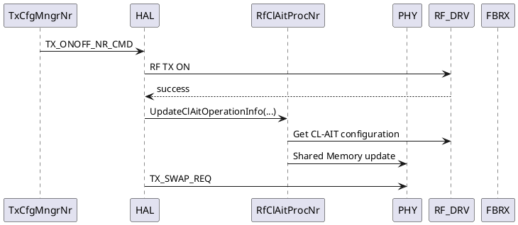

# CL-AIT NR As-Built HLD 정리/업데이트 착수 프롬프트

## 목적

현재 CL-AIT NR 코드 수정과 UT 코드 작성까지 완료된 상태다.

기존에 작성된 **Integrated NR HLD를 새로 작성하지 말고**, 현재 실제 구현 코드를 기준으로 검증·보강하여 **NR As-Built HLD**로 업데이트하라.

사용자는 개별 스킬 호출 순서를 직접 지정하지 않는다.  
`cl-ait-dev-orchestrator`를 단일 진입점으로 사용하고, 내부에서 필요한 경우 아래 스킬을 상황에 맞게 호출하라.

- `code-analyzer`
- `hld-code-implement`
- `hld-composer`
- `doc-converter`
- 필요 시 `hld-code-compare`

---

# 0. 최우선 원칙

1. **채팅은 임시 작업 공간이다.**
2. 기존 HLD / Decision Ledger / 최신 `gap_report.yaml` / 실제 구현 코드가 근거다.
3. **실제 코드에 없는 내용을 추정해서 HLD에 쓰지 마라.**
4. 기존 HLD를 폐기하고 처음부터 다시 작성하지 마라.
5. 기존 HLD의 설계 의도와 실제 구현이 다르면 차이를 숨기지 말고 `As-Built Deviation`으로 기록하라.
6. 이미 확정된 CL-AIT architecture decision을 임의 변경하지 마라.
7. 이번 단계는 **NR As-Built HLD 정리**가 목적이다.
8. LTE 구현은 수행하지 마라.
9. `code-fix`는 사용하지 마라.
10. 저사양 LLM에서 동작 가능하도록 전체 repository를 한 번에 분석하지 말고, 필요한 symbol/file/function 기준의 bounded analysis를 사용하라.

---

# 1. 현재 상태

현재 작업 상태는 다음과 같다.

```text
NR Integrated HLD               : 존재
NR gap_report.yaml              : 존재
NR 코드 수정                    : 완료
NR UT 코드 작성                 : 완료
Build Option 추가               : 반영됨 또는 최종 확인 필요
CMakeLists.txt 연동             : 반영됨 또는 최종 확인 필요
Generated file/source 연동      : 반영됨 또는 최종 확인 필요
Build/UT 실행 결과              : 실제 evidence 확인 필요
NR As-Built HLD                 : 아직 최종 정리 전
```

현재 구현은 기존 partial implementation을 이어서 완료한 결과다.  
기존 구현 내용을 새 baseline으로 재해석하거나 이전 diff를 잃어버리지 마라.

---

# 2. 현재 Architecture / Naming 기준

아래는 기존 Decision/HLD 기준으로 유지해야 한다.

## Target owner

```text
HAL
└─ RfClAitProcNr
```

- `RfClAitProcNr`는 CL-AIT NR runtime processor다.
- HAL ownership은 유지한다.
- `Rf`라는 이름을 RF Driver ownership으로 해석하지 마라.
- 기존 L1C `ClAitMngr`를 target architecture에 다시 넣지 마라.
- 별도 `ClAitConfigBuilder`를 새로 추가하지 마라.

## 주요 API

기준 API:

```cpp
RfClAitProcNr::UpdateClAitOperationInfo(...)
```

실제 구현 signature는 반드시 코드에서 확인해서 HLD에 반영하라.

---

# 3. NR TX ON As-Built 확인

기존 설계 기준:

```text
TX_ONOFF_NR_CMD
→ RF TX ON
→ RF TX ON 성공
→ RfClAitProcNr::UpdateClAitOperationInfo(...)
→ Shared Memory update
   - Enable
   - TxPwrThreshold
   - Period
→ TX_SWAP_REQ
```

다음 항목을 실제 코드로 확인하라.

- 실제 caller
- 실제 callee
- 실제 class/file
- 실제 argument
- `isScg` 전달 방식
- `domainType` 전달 방식
- RF TX ON 성공 판정 위치
- Shared Memory write 위치
- TX_SWAP_REQ와의 실제 ordering

설계와 코드가 다르면 `MATCH`, `IMPLEMENTATION_DETAIL_REFINED`, `DEVIATION`으로 구분하라.

---

# 4. NR Periodic Runtime As-Built 확인

기존 설계 기준:

```text
CL_AIT_DUMP_IND
→ TX Path ON guard
→ clait_enable 확인
→ CL_AIT_START_REQ
→ CL_AIT_START_CNF
   ├─ true  → PAL Timer
   └─ false → retry 1회
               ├─ true  → PAL Timer
               └─ false → current period skip
→ PAL Timer expiry
→ RF Driver AIT_Dump()
→ current period end
```

실제 코드에서 다음을 확인하라.

- DUMP_IND 실제 IPC 이름
- IPC handler
- payload
- `clait_enable` source
- TX Path ON 확인 source/API
- START_REQ 실제 IPC/API
- START_CNF 실제 IPC/API
- retry count / retry state
- retry가 정확히 1회인지
- retry 상태의 저장 위치
- PAL Timer API
- timer handle/context
- timer callback
- RF Driver dump API
- 실패/skip 시 period-local state 정리
- 다음 period로 retry/failure state가 carry-over 되지 않는지

확인할 수 없는 값은 추정하지 말고 `UNRESOLVED_CODE_FACT`로 남겨라.

---

# 5. Shared Memory / RF Driver As-Built 확인

다음 logical field를 실제 코드와 매핑하라.

```text
Enable
Tx Power Threshold
Period
```

확인 항목:

- 실제 struct 이름
- 실제 field 이름
- domain indexing
- write API
- RF Driver get API
- default/NV 값 획득 위치
- NR-specific field 변환
- `isScg` eligibility 적용 위치
- period 실제 단위
- period default 값

설계상의 이름과 실제 struct field 이름을 구분해서 문서화하라.

예:

```text
Logical name : TxPwrThreshold
Code field   : <actual field>
Owner        : <actual owner>
Source       : <actual RF API>
```

---

# 6. Build Integration As-Built 확인

이번 구현에서 중요한 추가사항이다.

다음 관계를 실제 코드 기준으로 반드시 HLD 또는 Implementation/Build section에 반영하라.

```text
Build Option
    ↓
CMakeLists.txt condition
    ↓
Generated file/source 선택
    ↓
Target source linkage
```

확인 항목:

- 실제 build option 이름
- option 정의 위치
- option 참조 위치
- `CMakeLists.txt` 파일 위치
- option condition
- 생성 파일명
- generated source/header 생성 위치
- target에 추가되는 방식
  - `target_sources`
  - `add_subdirectory`
  - 기타 실제 방식
- option ON일 때 생성/포함 여부
- option OFF일 때 기존 path 영향 여부

코드와 CMake 연결이 완전하지 않으면 HLD를 Freeze하지 말고 `BUILD_INTEGRATION_PENDING`으로 표시하라.

---

# 7. UT / Verification 정리

UT 코드 전체를 HLD에 복사하지 마라.

대신 HLD에는 다음 수준의 verification coverage를 기록하라.

예:

```text
Verification Coverage

- TX ON 이후 UpdateClAitOperationInfo 호출
- CL-AIT Enable/Disable 조건
- isScg eligibility
- Shared Memory Enable/Threshold/Period update
- TX Path OFF skip
- clait_enable=false skip
- START_REQ/CNF success
- START_CNF failure + retry once
- retry failure current period skip
- PAL Timer trigger
- RF Dump invocation
- Build Option ON
- Build Option OFF
- Generated source linkage
```

실제 존재하는 UT 기준으로만 작성하라.

UT가 없는 항목은 `NOT_COVERED`로 명시하라.

---

# 8. Build/UT Result Gate

코드와 UT 코드가 작성되어 있다고 해서 자동으로 HLD를 Freeze하지 마라.

실제 evidence를 확인하라.

## Case A — Build + UT PASS evidence 존재

```text
NR_AS_BUILT_HLD_STATUS = FREEZE_ALLOWED
```

→ 최종 As-Built HLD 생성 및 검증 진행

## Case B — Build 또는 UT 미실행 / 실패 / evidence 없음

```text
NR_AS_BUILT_HLD_STATUS = DRAFT_ONLY
```

→ HLD 업데이트는 수행 가능  
→ 최종 Freeze는 하지 말 것  
→ 미확인 validation 항목을 명확히 표시

---

# 9. HLD 업데이트 방법

기존 Integrated NR HLD를 source로 사용하라.

새 문서를 처음부터 재작성하지 말고 다음 순서로 진행하라.

```text
기존 Integrated NR HLD
+
실제 NR 구현 코드
+
UT 코드
+
최신 gap_report.yaml
+
hld-code-implement implementation evidence
+
hld_amend
        ↓
As-Built Gap 확인
        ↓
기존 HLD patch/update
        ↓
PlantUML 갱신
        ↓
Consistency validation
        ↓
NR As-Built HLD
```

---

# 10. gap_report / HLD Amendment 처리

최신 `gap_report.yaml`을 찾고 다음을 사용하라.

```text
meta.hld.*
gaps[].id
gaps[].hld_ref
gaps[].code_ref
gaps[].hld_amend
gaps[].fact_status
gaps[].implement_allowed
```

`hld_amend`는 `gap_report.yaml`을 SSOT로 사용하라.

이미 반영 완료된 amendment를 다시 적용하지 마라.

가능하면 GAP별로 다음 traceability를 유지하라.

| GAP ID | Design Requirement | Code Evidence | UT Evidence | HLD Section | Status |
|---|---|---|---|---|---|

Status 예:

```text
MATCH
IMPLEMENTATION_DETAIL_REFINED
HLD_UPDATED
DEVIATION
UNRESOLVED_CODE_FACT
NOT_COVERED
```

---

# 11. code-analyzer 사용 정책

전체 repository 광역 분석을 하지 마라.

필요한 경우 다음 범위만 targeted analysis하라.

- `RfClAitProcNr`
- `UpdateClAitOperationInfo`
- TX ON caller
- Shared Memory structure/API
- CL_AIT_DUMP_IND handler
- CL_AIT_START_REQ/CNF
- retry state
- PAL Timer
- RF Dump
- build option
- 관련 `CMakeLists.txt`
- generated source/file
- 관련 UT

이미 gap_report / implementation record에서 확정된 Fact는 중복 분석하지 마라.

---

# 12. PlantUML 업데이트

HLD의 MSC와 Block Diagram은 가능하면 Markdown 내부 PlantUML source로 유지하라.

예:



단, 위 예시를 실제 코드 확인 없이 그대로 최종 HLD에 사용하지 마라.

실제 participant / message / ordering에 맞춰 갱신하라.

Periodic MSC도 실제 구현 기준으로 갱신하라.

---

# 13. doc-converter 검증

HLD 업데이트 후 `doc-converter`를 이용해 가능한 범위에서 확인하라.

검증 목표:

```text
PlantUML syntax error          = 0
participant mismatch          = 0
message ordering mismatch     = 0
unmatched REQ/CNF             = 0
missing critical branch       = 0
broken heading/reference      = 0
```

doc-converter 기능 제한으로 검증할 수 없는 항목은:

```text
DOC_CONVERTER_LIMITATION
```

으로 남기되, 검증한 것처럼 쓰지 마라.

---

# 14. 최종 HLD에 반드시 포함할 섹션

기존 HLD 구조를 최대한 유지하되 아래 내용은 존재해야 한다.

```text
1. Purpose / Scope
2. Architecture Overview
3. Class / Ownership
4. Configuration & Shared Memory
5. TX ON Runtime
6. Periodic CL-AIT Runtime
7. FBRX Arbitration / START_REQ-CNF
8. Retry / Failure / Skip Behavior
9. PAL Timer / RF Dump
10. Build Option / CMake / Generated Source Integration
11. Verification / UT Coverage
12. As-Built Deviation
13. Open Code Facts
14. Traceability
15. PlantUML MSC / Block Diagram
```

---

# 15. As-Built Deviation Ledger

기존 HLD와 실제 구현이 다른 경우 반드시 표로 정리하라.

예:

| ID | HLD Design | Actual Implementation | Classification | Action |
|---|---|---|---|---|
| ABD-001 | xxx | yyy | IMPLEMENTATION_DETAIL_REFINED | HLD update |
| ABD-002 | xxx | yyy | DEVIATION | review required |

임의로 차이를 제거하거나 설계가 원래 그랬던 것처럼 수정하지 마라.

---

# 16. 최종 산출물

최종적으로 아래 파일을 생성하라.

```text
CL_AIT_NR_AsBuilt_HLD_<date>.md
CL_AIT_NR_AsBuilt_Traceability_<date>.md
CL_AIT_NR_AsBuilt_OpenFacts_<date>.md
```

가능하면 다음도 생성하라.

```text
CL_AIT_NR_AsBuilt_PlantUML_Validation_<date>.json
```

기존 HLD 파일을 직접 덮어쓰는 것보다 revision 파일을 우선 생성하라.

최종 Freeze가 가능한 경우에만 stable/final 이름으로 승격하라.

---

# 17. 사용자에게 마지막에 보고할 내용

장황한 로그를 보여주지 말고 아래 형식으로 요약하라.

```text
[NR As-Built HLD Result]

HLD status       : DRAFT | FREEZE_READY | FROZEN
Code alignment   : PASS | PARTIAL
Build integration: PASS | PENDING
Build            : PASS | FAIL | NOT_VERIFIED
UT               : PASS | FAIL | NOT_VERIFIED
PlantUML         : PASS | PARTIAL | NOT_VERIFIED

Updated sections :
- ...

As-Built deviations:
- ...

Open Code Facts:
- ...

Output:
- <HLD path>
- <Traceability path>
- <Open Facts path>

Next:
- FREEZE
또는
- 남은 validation 수행
```

---

# 18. 이번 단계 종료 조건

다음 조건을 만족하면 NR As-Built 단계 완료로 판정하라.

```text
실제 NR 코드와 HLD 정합
AND
Build integration 정합
AND
중요 runtime MSC 정합
AND
gap/amendment traceability 정리
AND
Open Code Fact 명시
AND
PlantUML 검증 가능한 범위 완료
```

Build/UT PASS evidence까지 존재하면:

```text
NR_AS_BUILT_HLD = FREEZE_READY
```

그렇지 않으면:

```text
NR_AS_BUILT_HLD = DRAFT
```

---

# 19. 작업 시작

위 원칙을 기준으로 현재 작업 디렉터리에서 기존 산출물과 실제 구현 상태를 자동 탐색하라.

처음부터 재분석하지 말고 현재 상태를 resume하라.

사용자에게 개별 스킬 선택을 요구하지 마라.

필요한 사용자 결정이 없다면 작업을 계속 진행하라.

불명확한 사실은 추정하지 말고 `UNRESOLVED_CODE_FACT`로 남겨라.

**목표는 “설계 문서 재작성”이 아니라 “실제 구현 결과를 반영한 NR As-Built HLD 완성”이다.**
